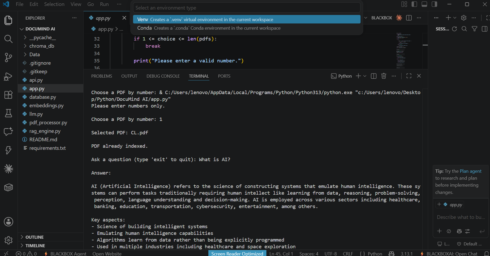
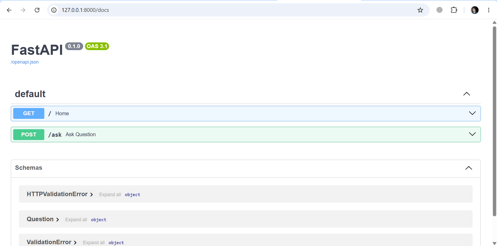

# 🧠 DocuMind AI

> An AI-powered PDF Question Answering System built using **Retrieval-Augmented Generation (RAG)**, **ChromaDB**, **Ollama**, and **FastAPI**.

DocuMind AI enables users to interact with PDF documents using natural language. The system extracts text from PDFs, converts it into semantic embeddings, stores them in a vector database, retrieves the most relevant context, and generates intelligent answers using a locally running Large Language Model (LLM).

---

# 📸 Demo

## 🖥️ Terminal Application



---

## 🌐 FastAPI Swagger UI



---

# ✨ Features

- 📄 PDF text extraction
- ✂️ Automatic text chunking
- 🧠 Semantic embeddings using Nomic Embed Text
- 🗂️ Vector storage with ChromaDB
- 🔍 Semantic similarity search
- 🤖 AI-generated answers using Qwen 2.5 (Ollama)
- 💬 Conversation memory
- 🌐 FastAPI backend with Swagger documentation
- 🖥️ Interactive terminal chatbot
- 📚 Support for indexing multiple PDF documents

---

# 🏗️ System Architecture

```text
                PDF Document
                     │
                     ▼
           PDF Text Extraction
                     │
                     ▼
              Text Chunking
                     │
                     ▼
          Nomic Embed Text Model
                     │
                     ▼
            ChromaDB Vector Store
                     │
                     ▼
         Semantic Similarity Search
                     │
                     ▼
            Retrieved PDF Context
                     │
                     ▼
           Qwen 2.5 LLM (Ollama)
                     │
                     ▼
              AI Generated Answer
```

---

# ⚙️ Tech Stack

| Category | Technology |
|----------|------------|
| Programming Language | Python |
| Large Language Model | Qwen 2.5 (Ollama) |
| Embedding Model | Nomic Embed Text |
| Vector Database | ChromaDB |
| Backend Framework | FastAPI |
| API Server | Uvicorn |
| PDF Processing | PyPDF |
| Similarity Search | Scikit-learn (Cosine Similarity) |

---

# 📂 Project Structure

```text
DocuMind-AI/

├── api.py                 # FastAPI backend
├── app.py                 # Terminal chatbot
├── rag_engine.py          # Main RAG workflow
├── database.py            # ChromaDB operations
├── embeddings.py          # Embedding generation
├── llm.py                 # Ollama interaction
├── pdf_processor.py       # PDF extraction & chunking
│
├── Data/
│
├── assets/
│   ├── terminal.png
│   └── fastAPI.png
│
├── README.md
├── requirements.txt
└── .gitignore
```

---

# 🚀 How It Works

1. Select a PDF document.
2. Extract text from the PDF.
3. Split the document into smaller chunks.
4. Generate vector embeddings for every chunk.
5. Store embeddings in ChromaDB.
6. Convert the user's question into an embedding.
7. Retrieve the most relevant document chunks.
8. Send the retrieved context to the LLM.
9. Generate a grounded answer based on the document.

---

# 🛠️ Installation

Clone the repository:

```bash
git clone https://github.com/aly-hashmi/DocuMind-AI.git
cd DocuMind-AI
```

Install dependencies:

```bash
pip install -r requirements.txt
```

---

# 🤖 Install Required Ollama Models

Pull the embedding model:

```bash
ollama pull nomic-embed-text
```

Pull the language model:

```bash
ollama pull qwen2.5:1.5b
```

Start the Ollama service before running the application.

---

# ▶️ Running the Application

## Terminal Version

Run:

```bash
python app.py
```

The application allows you to:

- Select a PDF document
- Ask questions about its contents
- Receive AI-generated responses based on the document

---

## FastAPI Backend

Start the API server:

```bash
uvicorn api:app --reload
```

Open the interactive API documentation:

```text
http://127.0.0.1:8000/docs
```

---

# 💡 Example Questions

- What is Machine Learning?
- Explain Artificial Intelligence.
- Summarize this chapter.
- List the important concepts.
- What are the advantages of deep learning?

---

# 📈 Future Improvements

- 🌐 React / Next.js frontend
- 📤 Drag-and-drop PDF uploads
- 📑 Multi-document conversations
- 🔐 User authentication
- 💾 Persistent chat history
- ⚡ Streaming LLM responses
- ☁️ Docker & cloud deployment
- 🔎 Hybrid keyword + semantic search

---

# 🎯 Learning Outcomes

This project demonstrates practical experience with:

- Retrieval-Augmented Generation (RAG)
- Large Language Models (LLMs)
- Vector Databases
- Semantic Search
- FastAPI Development
- REST API Design
- Local AI Deployment
- PDF Processing
- Document Intelligence

---

# 👨‍💻 Author

**Aly Hashmi**

Computer Science Student | Python & AI Enthusiast

- GitHub: https://github.com/aly-hashmi

---

## ⭐ Support

If you found this project interesting or helpful, consider giving it a **⭐ Star** on GitHub.
